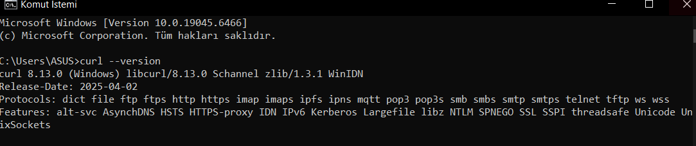
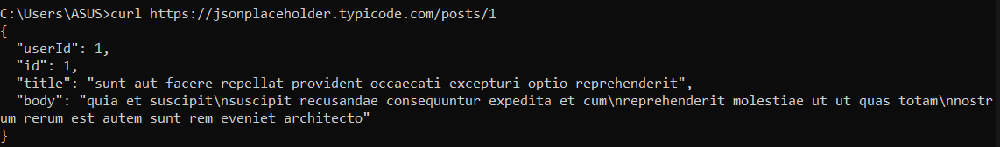
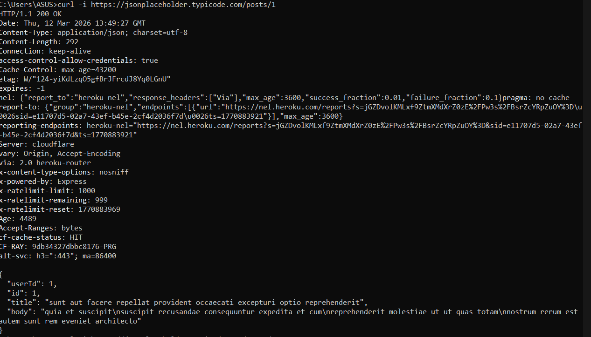
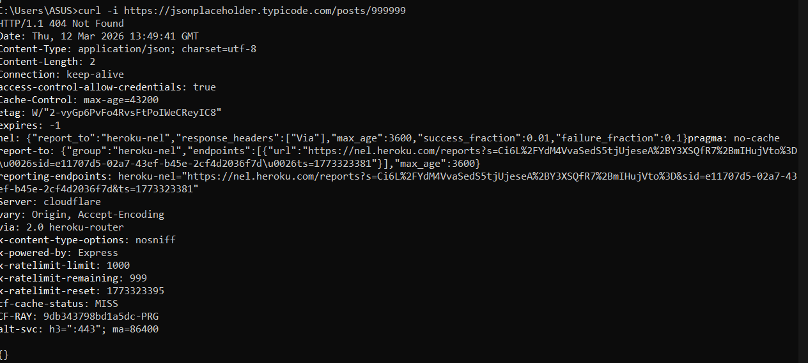
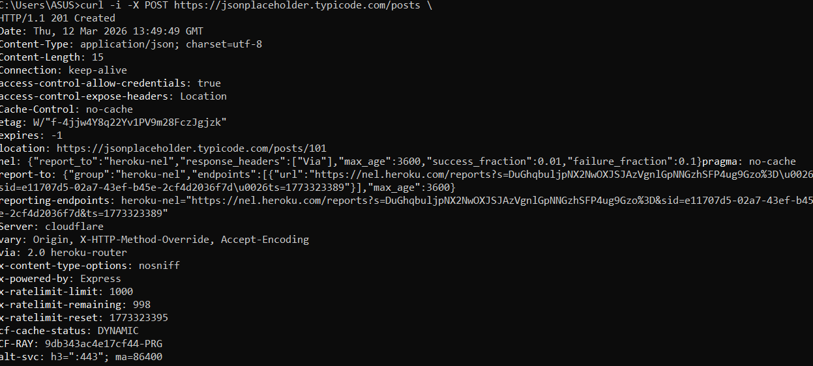
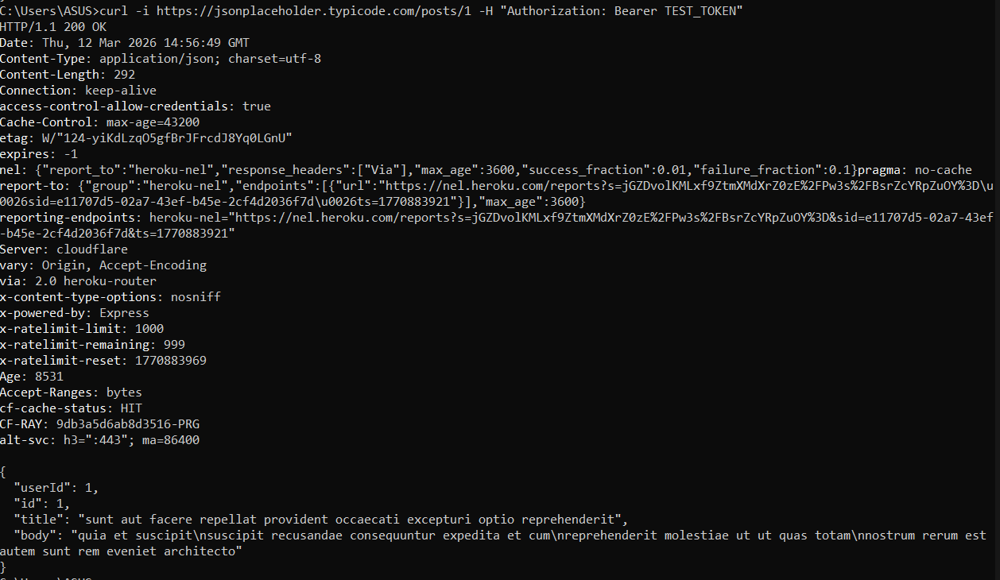
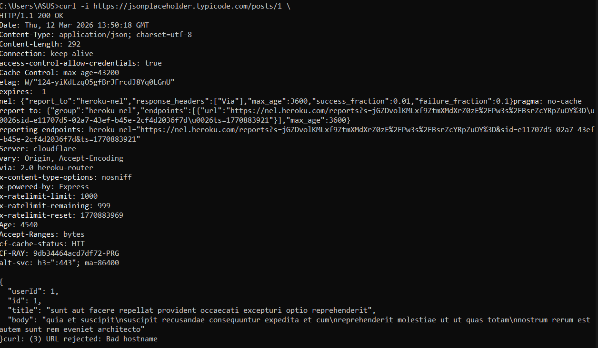

## Part 1 - Your First GET Request

### Command

```bash
curl --version
curl https://jsonplaceholder.typicode.com/posts/1
````

### Screenshot 1



### Screenshot 2



## Task 1. Questions

**A. What type of content did the server return?**
The server returned JSON data.

**B. Where do you see the resource ID?**
The resource ID appears in the JSON response as `"id": 1`.

**C. Can you see the HTTP status code?**
No. In the default `curl` output, the HTTP status code is not shown because response headers are hidden unless the `-i` option is used.

---

## Part 2 - Viewing Response Headers

### Command

```bash
curl -i https://jsonplaceholder.typicode.com/posts/1
```

### Screenshot 3


## Task 2. Questions

**D. What does 200 mean?**
`200` means the request was successful and the server returned the requested resource.

**E. What category of status code is it?**
It is a **2xx Success** status code.

**F. What other codes do you know?**
Some common codes are:

* `201 Created`
* `400 Bad Request`
* `401 Unauthorized`
* `403 Forbidden`
* `404 Not Found`
* `500 Internal Server Error`

## Task 3. Questions

**G. What would happen if Content-Type were `text/html` instead?**
The client would interpret the response as HTML instead of JSON. A browser might render it as a webpage.

**H. Does the content-length match the actual size of the body?**
Yes. The header showed `Content-Length: 292`, which matches the body size of the returned JSON response.

**I. Why is Connection important in high-traffic systems?**
The `Connection` header matters because it controls whether the TCP connection stays open or closes. In high-traffic systems, `keep-alive` improves performance by reducing connection overhead.

---

## Part 3 - Simulating HTTP Errors

### Command

```bash
curl -i https://jsonplaceholder.typicode.com/posts/999999
```

### Screenshot 4



## Task 4. Questions

**J. What status code did you receive?**
The server returned `404 Not Found`.

**K. Is there a response body?**
Yes. The response body exists, but it is empty JSON: `{}`.

**L. How does it differ from the successful case?**
In the successful case, the server returned `200 OK` and a full JSON object. In this case, it returned `404 Not Found` and an empty object.

---

## Part 4 - Sending Data with POST Request

### Command

```bash
curl -i -X POST https://jsonplaceholder.typicode.com/posts -H "Content-Type: application/json" -d "{\"title\":\"HTTP Lab\",\"body\":\"Testing POST\",\"userId\":1}"
```

### Screenshot 5



## Task 5. Questions

**M. What status code did the server return?**
The server returned `201 Created`.

**N. What does it mean?**
It means a new resource was successfully created on the server.

**O. What headers appear in this response?**
Some important headers are:

* `Content-Type: application/json; charset=utf-8`
* `Content-Length: 79`
* `location: https://jsonplaceholder.typicode.com/posts/101`
* `Server: cloudflare`
* `Connection: keep-alive`

---

## Part 5 - Sending Custom Headers

### Command

```bash
curl -i https://jsonplaceholder.typicode.com/posts/1 -H "Authorization: Bearer TEST_TOKEN"
```

### Screenshot 6



## Task 6. Questions

**P. Does this API actually validate the token?**
No. JSONPlaceholder is a test API and it does not actually validate the token.

**Q. What status code would a real secure API return if the token were invalid?**
A real secure API would usually return `401 Unauthorized`.

**R. What is the difference between `401` and `403`?**
`401 Unauthorized` means authentication is missing or invalid.
`403 Forbidden` means authentication may be valid, but access is not allowed.

---

## Part 6 - Headers Only (No Body)

### Command

```bash
curl -I https://jsonplaceholder.typicode.com/posts/1
```

### Screenshot 7



## Task 7. Questions

**S. When would this be useful?**
This is useful when checking server availability, response metadata, caching headers, or content type without downloading the full body.

**T. Why might monitoring systems use this approach?**
Monitoring systems use it because it is faster and lighter. They can verify whether a service is responding correctly without downloading unnecessary data.

---

## Part 7 - Status Code Classification

## Task 8. Question U

| Code | Category     | Meaning                                               |
| ---- | ------------ | ----------------------------------------------------- |
| 200  | Success      | OK. The request was successful                        |
| 201  | Success      | Created. A new resource was created                   |
| 400  | Client Error | Bad Request. The request is invalid                   |
| 401  | Client Error | Unauthorized. Authentication is missing or invalid    |
| 403  | Client Error | Forbidden. Access is denied                           |
| 404  | Client Error | Not Found. The resource does not exist                |
| 500  | Server Error | Internal Server Error. Something failed on the server |

---

## Part 8 - Discussion

**V. Why is it bad practice to always return `200`, even on errors?**
It is bad practice because clients cannot distinguish success from failure. Proper status codes are necessary for debugging, error handling, frontend logic, and monitoring systems.

---


