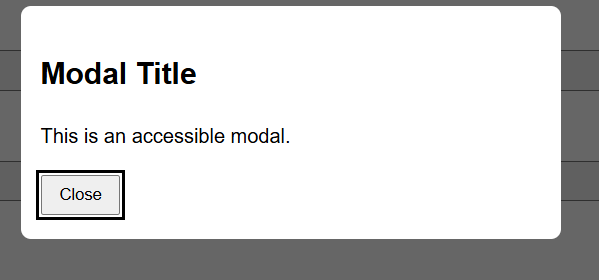
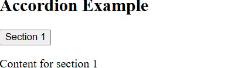
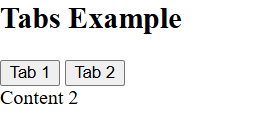
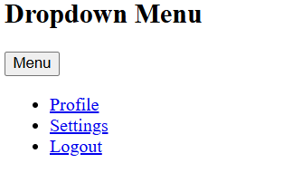
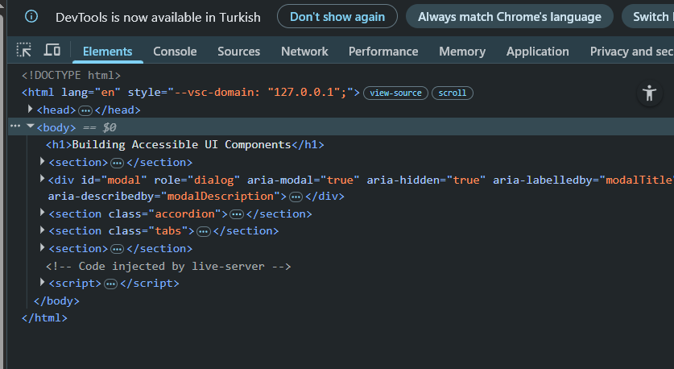
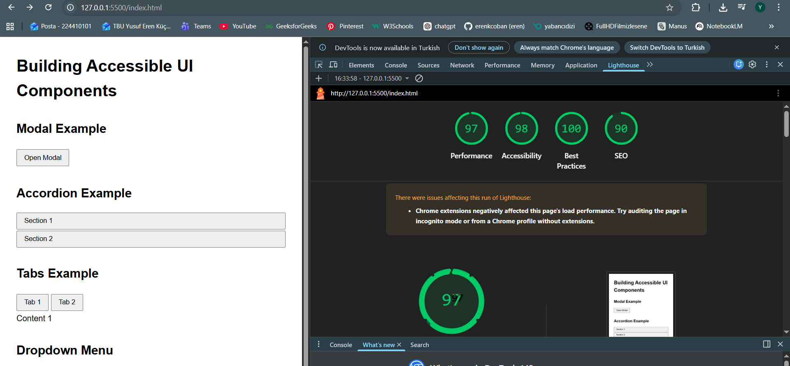

# Accessible UI Components

This project demonstrates how to build accessible UI components using native HTML, CSS, and JavaScript without frameworks.

The components implemented are:

* Accessible Modal Dialog
* Accordion
* Tabs
* Dropdown Menu

Accessibility principles used:

* Native HTML elements whenever possible
* ARIA attributes when necessary
* Keyboard accessibility
* Focus management
* Focus trapping in modal dialogs

---

# Modal Dialog

The modal dialog uses ARIA attributes to improve accessibility:

* `role="dialog"`
* `aria-modal="true"`
* `aria-hidden`

Focus is moved into the modal when it opens and returned to the trigger element when it closes.
Focus trapping ensures the keyboard cannot leave the modal while it is open.
The modal can be closed using the **Close button** or the **Escape key**.

## Screenshot

---

# Accordion

The accordion consists of buttons that toggle content panels.

Accessibility features:

* `aria-expanded` indicates whether a section is open
* `aria-controls` connects the button to its content
* Panels are shown or hidden using the `hidden` attribute

The accordion can be operated using mouse or keyboard.

## Screenshot

---

# Tabs

Tabs allow switching between different content panels.

Accessibility features:

* `role="tablist"`
* `role="tab"`
* `role="tabpanel"`
* `aria-selected`
* `aria-controls`

Only one tab can be active at a time and only the corresponding panel is visible.

## Screenshot

---

# Dropdown Menu

The dropdown menu is triggered by a button.

Accessibility features:

* `aria-haspopup="true"`
* `aria-expanded`
* Clicking outside the menu closes it
* The **Escape key** also closes the menu

## Screenshot

---

# Accessibility Inspection

The page was inspected using the **Accessibility Tree** in browser DevTools and tested with **Lighthouse Accessibility Audit**.

## Accessibility Tree

## Lighthouse Audit

---
